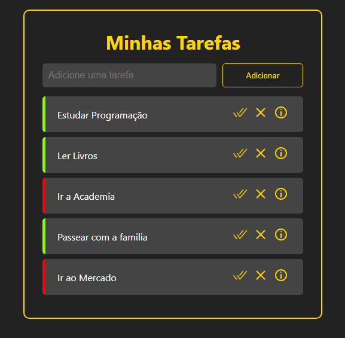

# Getting Started with Create React App

This project was bootstrapped with [Create React App](https://github.com/facebook/create-react-app).

## Available Scripts

In the project directory, you can run:

### `npm start`

Runs the app in the development mode.\
Open [http://localhost:3000](http://localhost:3000) to view it in your browser.

The page will reload when you make changes.\
You may also see any lint errors in the console.

### `npm test`

Launches the test runner in the interactive watch mode.\
See the section about [running tests](https://facebook.github.io/create-react-app/docs/running-tests) for more information.

### `npm run build`

Builds the app for production to the `build` folder.\
It correctly bundles React in production mode and optimizes the build for the best performance.

The build is minified and the filenames include the hashes.\
Your app is ready to be deployed!

See the section about [deployment](https://facebook.github.io/create-react-app/docs/deployment) for more information.

### `npm run eject`

**Note: this is a one-way operation. Once you `eject`, you can't go back!**

If you aren't satisfied with the build tool and configuration choices, you can `eject` at any time. This command will remove the single build dependency from your project.

Instead, it will copy all the configuration files and the transitive dependencies (webpack, Babel, ESLint, etc) right into your project so you have full control over them. All of the commands except `eject` will still work, but they will point to the copied scripts so you can tweak them. At this point you're on your own.

You don't have to ever use `eject`. The curated feature set is suitable for small and middle deployments, and you shouldn't feel obligated to use this feature. However we understand that this tool wouldn't be useful if you couldn't customize it when you are ready for it.

## Learn More

You can learn more in the [Create React App documentation](https://facebook.github.io/create-react-app/docs/getting-started).

To learn React, check out the [React documentation](https://reactjs.org/).

### Code Splitting

This section has moved here: [https://facebook.github.io/create-react-app/docs/code-splitting](https://facebook.github.io/create-react-app/docs/code-splitting)

### Analyzing the Bundle Size

This section has moved here: [https://facebook.github.io/create-react-app/docs/analyzing-the-bundle-size](https://facebook.github.io/create-react-app/docs/analyzing-the-bundle-size)

### Making a Progressive Web App

This section has moved here: [https://facebook.github.io/create-react-app/docs/making-a-progressive-web-app](https://facebook.github.io/create-react-app/docs/making-a-progressive-web-app)

### Advanced Configuration

This section has moved here: [https://facebook.github.io/create-react-app/docs/advanced-configuration](https://facebook.github.io/create-react-app/docs/advanced-configuration)

### Deployment

This section has moved here: [https://facebook.github.io/create-react-app/docs/deployment](https://facebook.github.io/create-react-app/docs/deployment)

### `npm run build` fails to minify

This section has moved here: [https://facebook.github.io/create-react-app/docs/troubleshooting#npm-run-build-fails-to-minify](https://facebook.github.io/create-react-app/docs/troubleshooting#npm-run-build-fails-to-minify)


##
<p align="center">
  <a href="#-tecnologias">Tecnologias</a>&nbsp;&nbsp;&nbsp;|&nbsp;&nbsp;&nbsp;
  <a href="#-projeto">Projeto</a>&nbsp;&nbsp;&nbsp;|&nbsp;&nbsp;&nbsp;
  <a href="#-layout">Layout</a>&nbsp;&nbsp;&nbsp;|&nbsp;&nbsp;&nbsp;
  <a href="#memo-licença">Licença</a>
</p>
<p align="center">
  


---
<div align='center'>
 <h1>
🚀 Task Manager App
</h1>

<h3>App To-do React</h3>
</div>
<div align="center">
 <!-- Substitua com uma imagem real do seu aplicativo ou um banner -->
</div>
<div style align="center"><br>

  
  
  
  
  
</div>
<br>
<div align='center'>
<h3 text aling="center">
Autor Ricardo Alexandre Costa 👨‍💻	
</h3> 
</div>
<br>
O **Task Manager App** é uma aplicação web moderna desenvolvida com **React** para ajudar você a gerenciar suas tarefas diárias. Este aplicativo permite que você adicione, visualize, complete e exclua tarefas de forma intuitiva. Além disso, você pode ver os detalhes de cada tarefa e navegar entre as páginas com facilidade.

## 📖 Índice

- [Sobre](#sobre)
- [Funcionalidades](#funcionalidades)
- [Demonstração](#demonstração)
- [Tecnologias Usadas](#tecnologias-usadas)
- [Instalação](#instalação)
- [Uso](#uso)
- [Contribuição](#contribuição)
- [Licença](#licença)

## 📜 Sobre

O **Task Manager App** é uma solução simples e eficaz para gerenciamento de tarefas pessoais ou profissionais. A aplicação oferece uma interface amigável e responsiva, ideal para usuários que desejam manter suas atividades organizadas.

## 🚀 Funcionalidades

- **Adicionar Tarefas**: Crie novas tarefas com um título descritivo.
- **Visualizar Tarefas**: Veja uma lista de suas tarefas com opções para marcar como concluída ou remover.
- **Marcar Tarefas como Concluídas**: Atualize o status das suas tarefas.
- **Remover Tarefas**: Exclua tarefas que não são mais necessárias.
- **Visualizar Detalhes da Tarefa**: Veja detalhes adicionais de cada tarefa.
- **Persistência de Dados**: As tarefas são salvas no armazenamento local do navegador para que você não perca suas informações.

## 🌟 Demonstração

Aqui está uma breve demonstração das funcionalidades do **Task Manager App**:

<video src="/React App - Google Chrome 2024-07-18 15-12-15.mp4" autoplay controls> <!-- Substitua com uma captura de tela real da sua aplicação -->

Você pode ver o aplicativo em funcionamento [aqui](https://your-deployment-url.com) (substitua com o link de demonstração, se disponível).

## 🛠 Tecnologias Usadas

- **React**: Biblioteca JavaScript para construir interfaces de usuário.
- **React Router**: Gerenciamento de navegação e roteamento.
- **UUID**: Gerador de identificadores únicos para tarefas.
- **LocalStorage**: Armazenamento local para persistência de dados.

## 🔧 Instalação

Para rodar o **Task Manager App** localmente, siga estas etapas:

### Pré-requisitos

- **Node.js** (v16.0.0 ou superior)
- **npm** (v7.0.0 ou superior) ou **yarn** (opcional)

### Passos para a Instalação

1. **Clone o repositório**:

   ```bash
   git clone https://github.com/seu-usuario/task-manager-app.git
   ```

2. **Navegue até o diretório do projeto**:

   ```bash
   cd task-manager-app
   ```

3. **Instale as dependências**:

   Com **npm**:

   ```bash
   npm install
   ```

   Ou com **yarn**:

   ```bash
   yarn install
   ```

4. **Inicie o servidor de desenvolvimento**:

   Com **npm**:

   ```bash
   npm start
   ```

   Ou com **yarn**:

   ```bash
   yarn start
   ```

   O aplicativo estará disponível em [http://localhost:3000](http://localhost:3000).

## 🎨 Uso

Após iniciar o servidor de desenvolvimento, abra [http://localhost:3000](http://localhost:3000) em seu navegador para ver a aplicação em ação. 

### Navegação

- **Adicionar Tarefa**: Insira um título para a tarefa e clique no botão **Adicionar**.
- **Visualizar Tarefas**: Clique no título de uma tarefa para marcá-la como concluída.
- **Remover Tarefa**: Clique no ícone de remoção para excluir a tarefa.
- **Ver Detalhes da Tarefa**: Clique no ícone de informações para ver os detalhes da tarefa.

## 🤝 Contribuição

Contribuições são bem-vindas! Se você deseja contribuir para o projeto, siga estas etapas:

1. **Fork o repositório**.
2. **Crie uma branch** para sua feature ou correção:

   ```bash
   git checkout -b minha-nova-funcionalidade
   ```

3. **Faça suas alterações e commit**:

   ```bash
   git add .
   git commit -m "Adiciona nova funcionalidade"
   ```

4. **Push para sua branch**:

   ```bash
   git push origin minha-nova-funcionalidade
   ```

5. **Crie um Pull Request** no GitHub.

## 📜 Licença

Este projeto está licenciado sob a licença MIT - veja o arquivo [LICENSE](LICENSE) para mais detalhes.

---

**Desenvolvido por [Ricardo Costa](https://github.com/ricardoazcosta)**

Conecte-se comigo 
## Contato 


<a href = "https://www.linkedin.com/in/ricardo-alexandre-costa1985/">
</a>

<a href = "https://wa.me/18997490885"></a><br>
  <a href = "mailto:contatoricardozanete@gmail.com"></a>


Espero que este README.md atenda às suas necessidades! Sinta-se à vontade para personalizá-lo ainda mais com base no que você deseja destacar sobre seu projeto.


